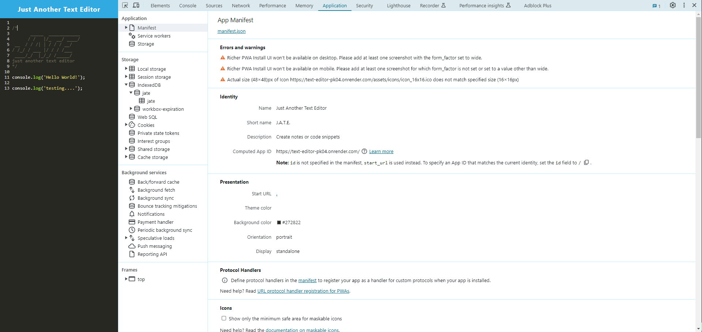
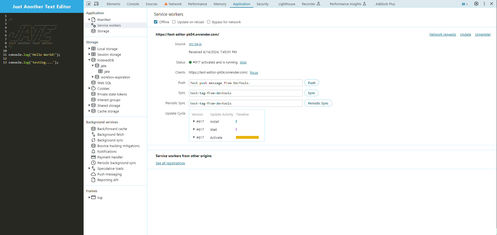
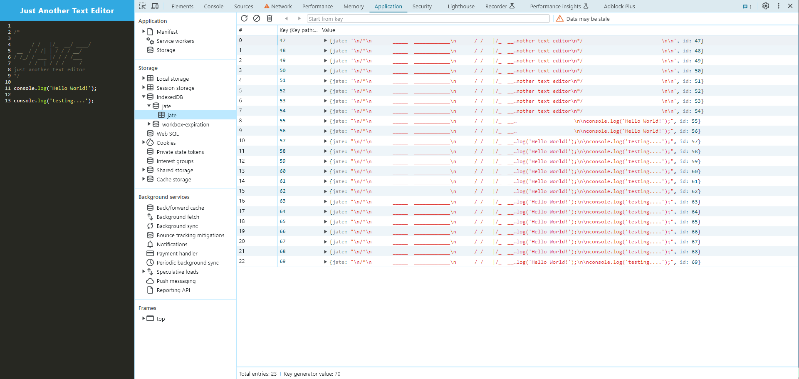

# Progressive Web Application: Text Editor
[](https://github.com/apri1mayrain/text-editor?tab=MIT-1-ov-file)
[](https://nodejs.org/en)
[](https://expressjs.com/)
[](https://developer.mozilla.org/en-US/docs/Web/Progressive_web_apps/Guides/What_is_a_progressive_web_app)

## Table of Contents
- [Description](#description)
- [Deployment](#deployment)
- [Features](#features)
- [Installation](#installation)
- [Screenshots](#screenshots)
- [Credits](#credits)
- [License](#license)

## Description

This app is a text editor that runs in the browser. It is a single-page application and can also be installed as a [Progressive Web Application (PWA)](https://developer.mozilla.org/en-US/docs/Web/Progressive_web_apps). It contains data persistence techniques (IndexedDB) and functions offline (service worker & page and asset caching).

### User Story

```md
AS A developer
I WANT to create notes or code snippets with or without an internet connection
SO THAT I can reliably retrieve them for later use
```

### Acceptance Criteria

```md
GIVEN a text editor web application
WHEN I open my application in my editor
THEN I should see a client server folder structure
WHEN I run `npm run start` from the root directory
THEN I find that my application should start up the backend and serve the client
WHEN I run the text editor application from my terminal
THEN I find that my JavaScript files have been bundled using webpack
WHEN I run my webpack plugins
THEN I find that I have a generated HTML file, service worker, and a manifest file
WHEN I use next-gen JavaScript in my application
THEN I find that the text editor still functions in the browser without errors
WHEN I open the text editor
THEN I find that IndexedDB has immediately created a database storage
WHEN I enter content and subsequently click off of the DOM window
THEN I find that the content in the text editor has been saved with IndexedDB
WHEN I reopen the text editor after closing it
THEN I find that the content in the text editor has been retrieved from our IndexedDB
WHEN I click on the Install button
THEN I download my web application as an icon on my desktop
WHEN I load my web application
THEN I should have a registered service worker using workbox
WHEN I register a service worker
THEN I should have my static assets pre cached upon loading along with subsequent pages and static assets
WHEN I deploy to Render
THEN I should have proper build scripts for a webpack application
```

## Deployment

[Please visit the Text Editor PWA on Render by clicking here!](https://text-editor-pk04.onrender.com)

## Features

* [Node.js](https://nodejs.org/en) to execute JavaScript in CLI or *outside* of web browser.
* [Express.js](https://expressjs.com/) to implement back-end web framework for routing.
* [Various NPM packages](https://github.com/apri1mayrain/text-editor/blob/main/client/package.json) to create webpack bundle, service worker, cache page and static assets, and retrieve/store text editor content in IndexedDB.


## Installation

1. Download [Node.js](https://nodejs.org/en).
2. Download repo files by [cloning the repo](https://docs.github.com/en/repositories/creating-and-managing-repositories/cloning-a-repository#cloning-a-repository) or [downloading the ZIP folder](https://github.com/apri1mayrain/text-editor/archive/refs/heads/main.zip). If downloading ZIP folder, please be sure to extract the folder.
3. Open your preferred command line interface and navigate to the file directory containing the repo.
4. Install the NPMs with command: `npm install`
4. Start the app: `npm start`

## Screenshots

The following animation demonstrates the application functionality:


The following image shows the application's `manifest.json` file:



The following image shows the application's registered service worker:



The following image shows the application's IndexedDB storage:



## Credits

* Starter code can be found here: [https://github.com/coding-boot-camp/cautious-meme](https://github.com/coding-boot-camp/cautious-meme)
* Researched [MDN Web Docs](https://developer.mozilla.org/en-US/), [Stack Overflow](https://stackoverflow.com/) forums, and other coding resources.

## License

MIT License - Copyright © 2024 apri1mayrain

[(Go back to top)](#progressive-web-application-text-editor)